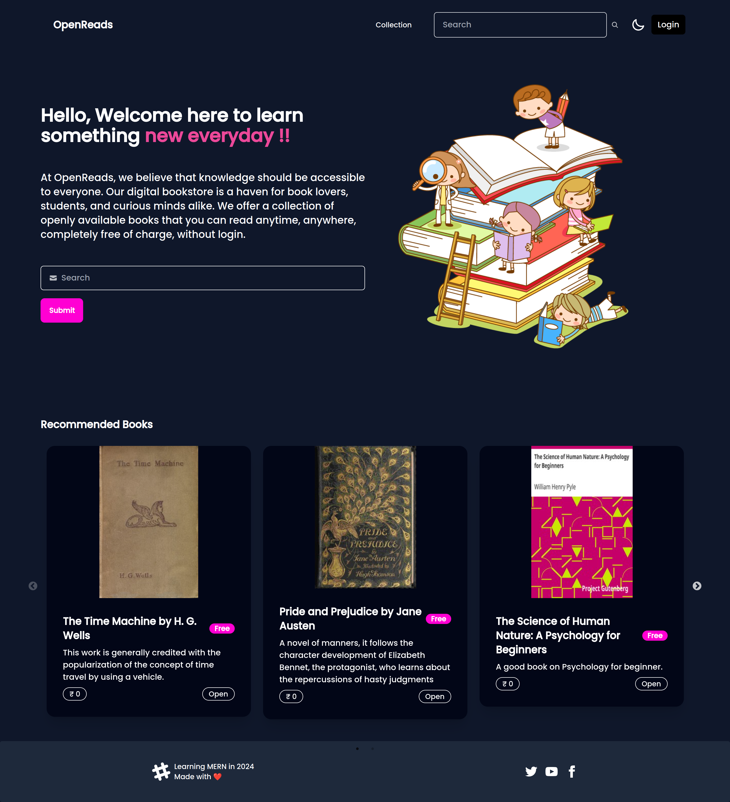

# OpenReads

A digital book store to contain openly available unlicensed free books in a categorised way. (Work in Progress)
<div align="center">
<picture>
  <source media="(prefers-color-scheme: light)" srcset="./Backend/Images/screen_light.png">
  
</picture>
</div>

Current State
-----
* Framework to store book details done.
* Frontend of recommended books and collections done.
* User Authentication.
* MongoDB based cloud database support.

TODO
-----
* Add Search function & link book pdf support.
* Adding support for reading books.
* Ability to do crowd source.
* Add user favourite section.


Usage
-----
1. Install Nodejs
2. Run 
```
 git clone https://github.com/kmAyush/OpenReads.git
 cd OpenReads/
 npm install
 cd Frontend
 npm run build
 cd ..
 npm start
 
```
3. Go to http://localhost:4001

Implementation
-----
This project is build as a learning process for MERN stack.

* Frontend utilizes React + Vite. 
* Frontend templates inspired from DaisyUI
* Backend support nodejs
* Database support MongoDB.
<br/><br/>

The tutorial followed in building this project - <br> 
https://www.youtube.com/watch?v=7l5UgtWfnw0